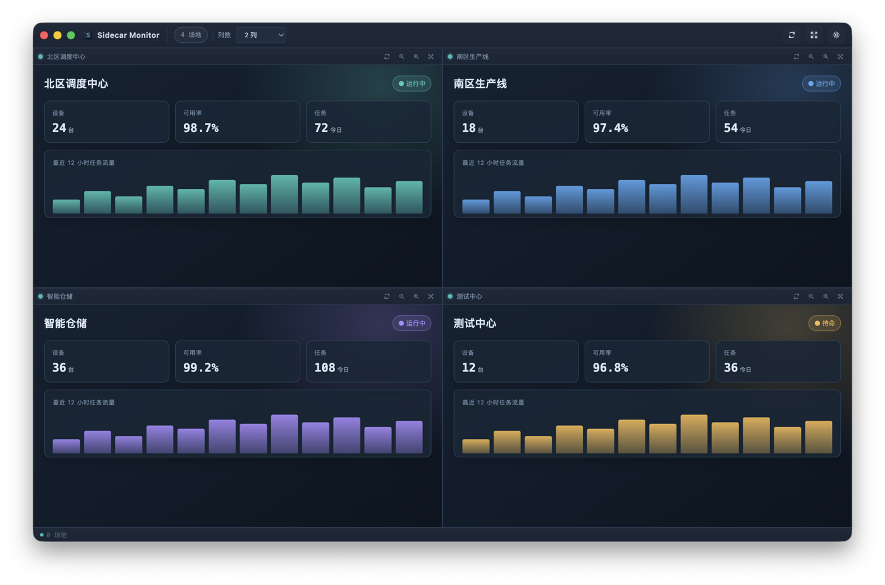
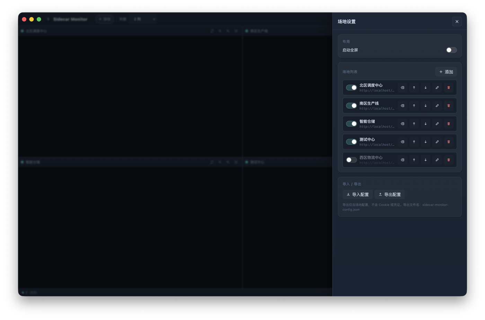
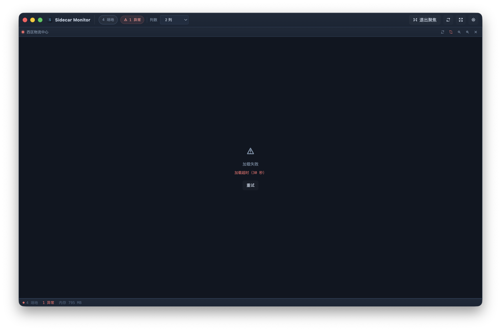
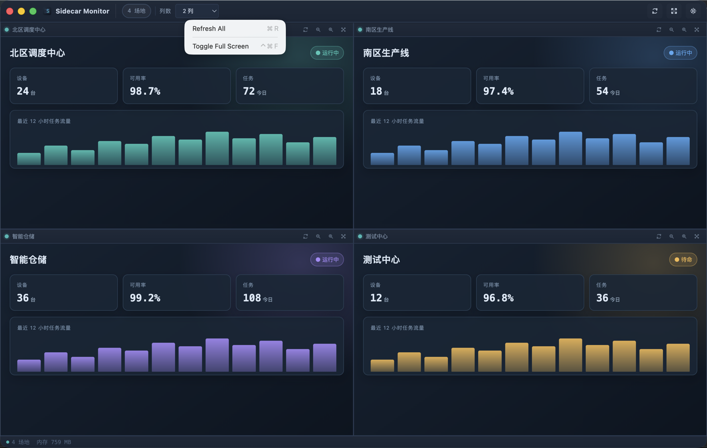

# Sidecar Monitor

多场地 Sidecar 监控桌面工具（Electron + Vue 3）。

## 概述

`Sidecar Monitor` 在一个桌面窗口内同时显示多个 OpenTCS Sidecar 场地页面，支持会话隔离、配置持久化、聚焦模式和跨平台打包。

## 界面预览

以下画面使用本地模拟数据，不包含真实站点、账号或凭证。

### 多场地总览



四个场地以双列网格同时展示，顶部可快速调整列数、刷新页面、切换全屏或打开设置。

### 场地设置



在设置抽屉中管理场地启用状态、顺序、登录数据及配置导入导出。

### 异常恢复



页面加载失败或超时时会显示明确原因，并提供重试和恢复入口。

### macOS 原生菜单



macOS 使用原生菜单和快捷键；Windows 与 Linux 提供同等功能，并遵循各自平台的菜单惯例。

## 开发

**前置要求：** Node.js 20.19+（推荐 22.12+），npm 10+

```bash
npm install

# 开发模式（含热重载）
npm run dev

# 类型检查
npm run typecheck

# 单元测试
npm run test

# 生产构建
npm run build
```

## 场地配置

配置文件存储于：

| 平台    | 路径                                        |
|---------|---------------------------------------------|
| macOS   | `~/Library/Application Support/sidecar-monitor/config.json` |
| Windows | `%APPDATA%\sidecar-monitor\config.json`     |
| Linux   | `~/.config/sidecar-monitor/config.json`     |

配置采用原子写入（先写 `.config.json.tmp` 再重命名），防止意外截断。

导出配置的默认文件名：`sidecar-monitor-config.json`。


### Cookie 加密说明

macOS 和 Windows 使用操作系统密钥链对 Chromium Cookie 加密，加密时绑定 **当前用户 + appId**。  
更改 appId 后，即使 Cookie 文件已复制，浏览器也可能无法解密。  
场地配置（URL、缩放等）不受影响；Cookie 无法迁移时请在对应场地重新登录。

## 会话隔离

每个场地使用独立的持久 Chromium Session（`persist:site-<id>`），存储路径：

```
<userData>/Partitions/site-<id>/
```

通过"设置 → 清除登录状态"可清除指定场地的所有本地数据（Cookie、localStorage、IndexedDB）。

监控站点使用当前运行时生成的标准 Chromium User-Agent，不暴露 Electron 或
Sidecar Monitor 产品标识。这样可避免 Emby 等网站将普通网页容器误判为带有原生桥接
能力的 Electron 客户端；Chromium 版本和操作系统信息仍保持真实。

## 布局

- **自动列数**：在不同数量的场地下最大化单个视图面积，对相同面积优先选择接近容器长宽比的布局。
- **手动列数**：工具栏下拉框可选 1-20 列。
- **聚焦模式**：单击场地标题栏中的 ⊡，单个场地全屏展示；点 ✕ 或工具栏"退出聚焦"恢复。
- **排序**：设置面板中的 ↑↓ 按钮调整场地显示顺序。

## 场地加载调度

- **最大并发**：初始化时最多同时加载 **2 个**场地（`loadScheduler` 默认并发量）；超出的场地按 FIFO 顺序排队，待前序加载完成后自动启动。
- **超时**：主文档加载计时 **30 秒**，超时后场地切换为 `failed` 状态并显示超时原因。
- **状态机**：

  | 状态            | 说明                                                           |
  |-----------------|----------------------------------------------------------------|
  | `loading`       | 正在加载中                                                     |
  | `ready`         | 加载成功，内容可见                                             |
  | `failed`        | 加载失败或超时，显示错误原因；可手动刷新重试                   |
  | `crashed`       | 渲染进程崩溃，需手动刷新恢复                                   |
  | `unresponsive`  | 渲染进程无响应；收到 `responsive` 事件后自动恢复为 `ready`     |

- 设置抽屉打开期间，所有场地视图隐藏；关闭后自动恢复可见性，并应用期间积压的配置变更。

## 跨平台构建

本地打包应在对应操作系统上执行：

```bash
npm run dist:mac      # macOS DMG + ZIP（x64 + arm64）
npm run dist:win      # Windows NSIS 安装包（x64）
npm run dist:linux    # Linux AppImage + deb + rpm（当前主机架构）
```

每个 `dist:*` 命令都会先清空整个 `release/` 目录，避免旧版本或其他平台的产物残留。
如需保留已有产物，请先将其复制到其他目录。普通 `npm run build` 不会清理安装包，
也不会修改系统中已安装的应用。

在 macOS 或 Linux 上也可显式指定 Linux 架构：

```bash
npm run build
npx electron-builder --linux AppImage deb rpm --x64
npx electron-builder --linux AppImage deb rpm --arm64
```

macOS 交叉构建 rpm 前需安装 `rpmbuild`：

```bash
brew install rpm
```

不建议在一台机器上交叉构建全部平台。仓库中的
`.github/workflows/build-release.yml` 会使用 macOS、Windows、Linux x64 和
Linux arm64 原生 Runner 并行生成完整产物：

1. 在 GitHub 仓库的 **Actions → Build and release → Run workflow** 手动触发。
2. 构建完成后，在该工作流运行页面的 **Artifacts** 区域下载三平台产物。
3. 发布版本时，先将 `package.json` 中的版本更新为目标版本，再推送同版本标签：

```bash
git tag v0.1.1
git push origin v0.1.1
```

`v*` 标签会触发构建并自动创建 GitHub Release。标签必须与 `package.json`
版本一致，否则发布任务会失败；手动触发只上传 Actions Artifacts，不创建 Release。

产物命名（由 `electron-builder.yml` 中的 `artifactName` 控制）：

| 平台/格式       | 架构        | 文件名示例                                      |
|-----------------|-------------|-------------------------------------------------|
| macOS ZIP       | x64         | `sidecar-monitor-0.1.1-x64.zip`                 |
| Windows NSIS    | x64         | `sidecar-monitor-0.1.1-x64.exe`                 |
| Linux AppImage  | x64/arm64   | `sidecar-monitor-0.1.1-x86_64.AppImage`         |
| Linux deb       | x64/arm64   | `sidecar-monitor-0.1.1-amd64.deb`               |
| Linux rpm       | x64/arm64   | `sidecar-monitor-0.1.1-x86_64.rpm`              |

Linux 的 x64 与 arm64 均提供 AppImage、deb、rpm，共六个安装包。GitHub
Actions 中分别保存为 `sidecar-monitor-linux-x64` 和
`sidecar-monitor-linux-arm64` Artifact。

### Linux 安装

Ubuntu/Debian 推荐下载与 CPU 架构匹配的 `.deb` 文件，双击后通过 App Center
或系统软件安装器确认安装。安装完成后可从应用菜单启动。也可使用命令行：

```bash
sudo apt install ./sidecar-monitor-0.1.1-amd64.deb
```

Fedora/RHEL 系发行版使用 rpm：

```bash
sudo dnf install ./sidecar-monitor-0.1.1-x86_64.rpm
```

AppImage 无需安装：

```bash
chmod +x sidecar-monitor-0.1.1-x86_64.AppImage
./sidecar-monitor-0.1.1-x86_64.AppImage
```

> 构建目标、架构、脚本或工作流发生变化时，必须在同一变更中同步更新本节。

> 当前 CI 产物未签名。macOS 正式发布需 Developer ID 签名与公证，Windows
> 正式发布建议使用代码签名证书；未签名安装包可能触发系统安全提示。

## 安全设计

- `nodeIntegration: false`，`contextIsolation: true`，`sandbox: true`（每个 WebContentsView）
- 主窗口渲染器与场地视图通过 contextBridge 隔离（`window.monitorAPI`）
- **导航与重定向策略**（`navigationPolicy.ts`）：
  - 服务端 HTTP(S) 3xx 重定向（301/302/307/308，含跨源链式跳转）：**允许**；最终落地 URL 的源成为新的受信源
  - 渲染进程或用户发起的跨源主框架导航（`will-navigate`）：**始终阻止**
  - 同源主框架导航（SPA 路由、登录流程等）：允许
  - 子框架 HTTP(S) 导航/重定向：允许，但不更新受信源
  - 非 http(s) 协议（`file:`/`javascript:`/`data:`/`blob:` 等）：任何框架均阻止
  - 新窗口/弹出窗口：拒绝（`setWindowOpenHandler → deny`）
- Session 级别权限全部拒绝（摄像头、麦克风、通知等）
- 禁止下载（`will-download` 阻止）
- 默认使用 Chromium TLS 校验，不旁路证书验证

## 菜单功能

应用提供原生菜单，支持键盘快捷键：

| 菜单           | 操作                | 快捷键              | 说明                            |
|----------------|---------------------|---------------------|---------------------------------|
| macOS 应用菜单 | 关于 Sidecar Monitor vX.Y.Z | —          | 显示含版本号与 Copyright © 2026 的原生关于面板 |
| macOS 应用菜单 / File（Win/Linux） | 设置 | ⌘, / Ctrl+, | 打开设置抽屉               |
| File           | 导入配置            | ⌘⇧I / Ctrl+Shift+I  | 从 JSON 文件导入场地配置        |
| File           | 导出配置            | ⌘⇧E / Ctrl+Shift+E  | 导出当前配置为 JSON 文件        |
| View           | 全部刷新            | ⌘R / Ctrl+R         | 显示确认对话框后刷新所有场地    |
| View           | 切换全屏            | Ctrl+⌘F（macOS）/ F11 | 切换全屏模式                  |
| Layout         | Auto / 1–20 列      | —                   | 单选项，与工具栏列数选项同步    |
| Help           | 项目主页            | —                   | 打开 GitHub 仓库页面            |
| Help（Win/Linux）| 关于 vX.Y.Z       | —                   | 显示关于对话框                  |

- **版本号**：菜单中关于项的标签动态读取 `app.getVersion()`，始终与打包版本一致，无硬编码。
- **Layout 同步**：通过工具栏、配置导入或菜单更改列数后，Layout 菜单单选项自动更新。
- **Refresh All 确认**：菜单触发与工具栏按钮走相同的确认对话框流程，不绕过确认。
- **CI 烟雾测试**：`tests/electron-smoke.mjs` 在每个 CI Runner（macOS、Windows、Linux x64/arm64）上通过 Playwright 驱动真实原生菜单（按菜单项 ID 调用 `.click()`），覆盖菜单渲染与 IPC 完整链路。

## 图标素材

应用图标使用深蓝、青蓝的多窗口监控图形，源文件和平台产物位于 `resources/`：

| 文件/目录         | 规格                          | 平台/用途    |
|-------------------|-------------------------------|--------------|
| `icon.svg`        | 可编辑矢量源文件              | 源素材       |
| `icon.icns`       | macOS 标准格式，用于应用包与 DMG 封面 | macOS  |
| `icon.ico`        | 多分辨率 ICO，用于 EXE 图标、NSIS 安装器与卸载器 | Windows |
| `icon.png`        | 1024×1024 px                  | 运行时窗口图标 |
| `icons/16x16.png` – `icons/1024x1024.png` | 8 个标准尺寸 PNG，hicolor 目录格式 | Linux deb/rpm/AppImage（electron-builder 需要目录而非单一文件） |

## 内部 API

Preload 通过 `contextBridge.exposeInMainWorld('monitorAPI', ...)` 暴露 `window.monitorAPI`（类型：`MonitorAPI`）。
